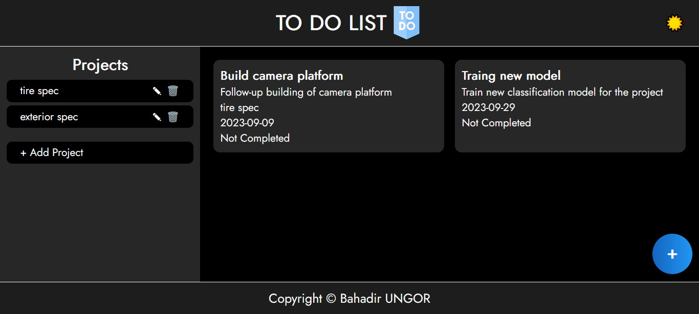

# To Do App
Simple To Do app where you can follow-up different task from different projects. It uses browser's local cache to store your tasks & projects.

Link to the website → [**To Do App**](https://bahaungor.github.io/todo/)

# Table Of Content
- [Introduction](#introduction)
- [Languages and Tools](#languages-and-tools)
- [Credits](#credits)

# Introduction
This webpage made for Odin Projects as a part of Full Stack Web Development curriculum. I used JS, CSS and HTML to build this website.

# Languages and Tools

# Credits
Bahadir Ungor | Artificial Intelligence Engineer @ 

